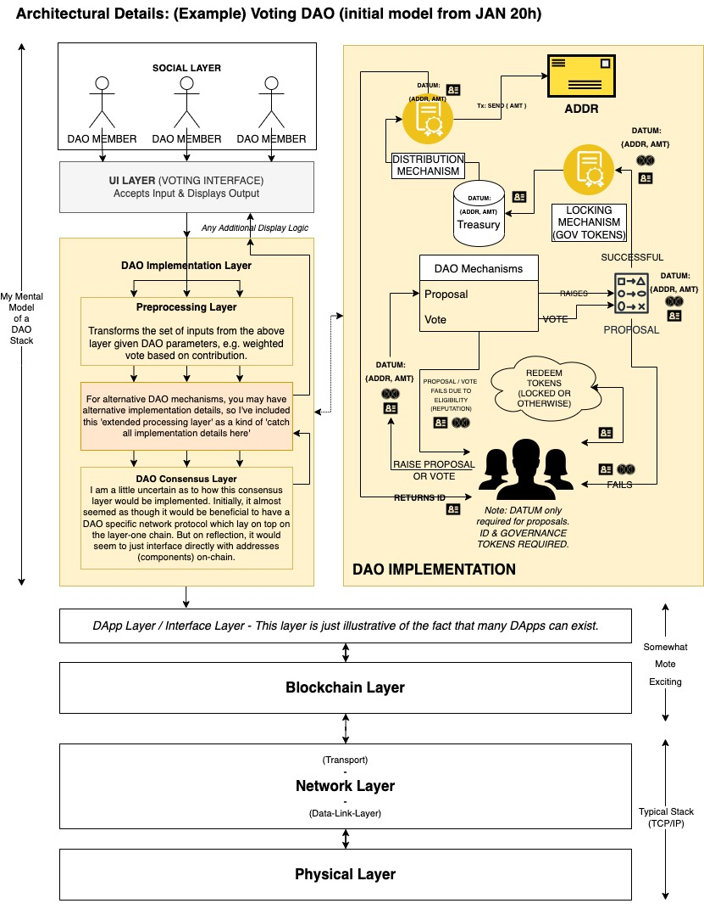

### Materials For 'Tech' Discussion

* Date: Friday 21st January
* Time: 22:00 UTC
* Duration: Variable

**Overview**

The intention behind this discussion is to clarify ones own mental model(s) regarding the design (from a relatively high level of abstraction) of decentralised autonomous organisations and their tooling. Thus, this discussion does not have to include granular technical details, making it accessible for anybody to listen in. It is advantageous to ensure everybody is on the same page when modelling complex systems.

**Aims & Objectives**

* Review the architectural design of a DAO.
* Ensure everybody who attends has the same (or a similar) conceptual/mental model.
* Discuss DAOs in general (from design considerations to sociological and anthropological implications).
* Review a general project roadmap.
* Have some degree of fun (it is a Friday evening, right?)

**(Possible & Optional) Discussion Points**

* High-level architectural design, validating the mental model.
* Existing implementations, their feature sets and their shortcomings.
* Potential for conceptual design debt (path dependencies).
* Operational mechanisms (proposals, voting).
* Possible attack vectors.
* Supervisory considerations.
* Liability, accountability, fiduciary responsibility & insurance.
* DAOs interfacing with DAOs, scale-free network topologies & clustering.
* The importance of decentralisation & methodologies for maintaining decentralisation.
* Sociological and anthropological discussion (optimal group sizes, spontaneous order).
* Possibly HCI & UX.
* New and interesting ideas, general discussion, Friday night funkin, open forum.

**Supplementary Materials**

My mental model (stack-based & general UML based processes):

**Self-Directed Learning**

I spent this week learning as much as possible about DAOs. Essentially I would just like to confirm that what I have learnt is consistent with the way in which other people think about and model these systems.

Notes on this weeks research are available here: <https://github.com/jonathondilworth/DAOResearch>

