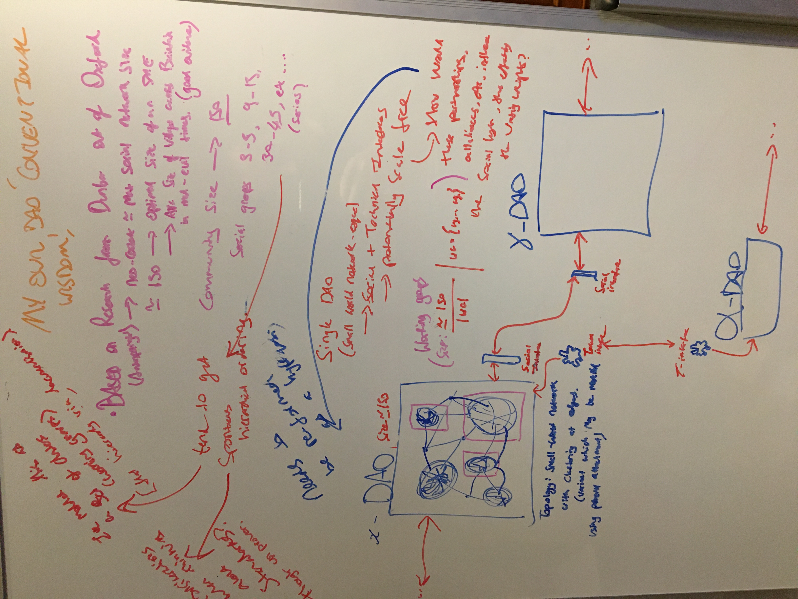

### Meeting Prep For Friday 21st 22:00 UTC

Preface: I've done some of my own research over the last week or so. Thus, we may not need to go into as much technical depth. I would, however, be extremely grateful if the following could be addressed:

* General Design of DAOs: all I'm looking to do is validate the model I have created, does this model make sense?

View Model

* Current Implementations: I already have reviewed some of the literature that compares current implementations. I am a little fuzzy on Holographic voting, I can likely read up on this myself, however, if it's easy to explain in a couple of minutes, that would be handy.

* Are there vulnerabilities in the weighted NFT based reputation approach as outlined in the DAO of DAOs paper? This is why the case is made for supporting weighted keys?

* My Conventional Wisdom! Does it make sense? Has this kind of thing been thought about?

View My Potentially Naive Conventional Wisdom (Hah!) - We can discuss these if there is time.

Through reviewing papers, this is just what I've been thinking about:

**Given:**

> "Specifically, we argue that OSS community networks characterized by small-world properties would positively influence the productivity of the member developers by providing them with speedy and reliable access to more quantity and variety of information and knowledge resources."  
> 
> "After accounting for project, foundry, and time-specific observed and unobserved effects, we found a statistically significant relationship between small-world properties of a community and the technical and commercial success of the software produced by its members."

*Singh, P.V., 2010. The small-world effect: The influence of macro-level properties of developer collaboration networks on open-source project success. ACM Transactions on Software Engineering and Methodology (TOSEM), 20(2), pp.1-27.*

**Further, when considering:**

*Hill, R.A., Dunbar, R.I.M. Social network size in humans. Hum Nat 14, 53–72 (2003). https://doi.org/10.1007/s12110-003-1016-y*

*Dunbar, R. (1993). Coevolution of neocortical size, group size and language in humans. Behavioral and Brain Sciences, 16(4), 681-694. doi:10.1017/S0140525X00032325*

Given our working groups, it would appear that multiple small world networks topologies contained within the DAO have emerged, with edges linking these networks together. Furthermore, one may somewhat speculatively consider the cardinality (size) of the set of ADAO members (and assume a degree of variance in member activity), resulting (again, somewhat speculatively) in a size that approximates 'Dunbars Number' (150). In this case, strictly speaking, it's 50% larger, but again, considerations of variance.

**So, what does this mean?**

Since optimal sizes for SMEs is ~= 150, when setting (I wouldn't go as far as saying standards, but perhaps guidelines), providing these resources (or references) as a means to justify containing the core DAO size to ~= 150 may be considered (for optimal performance). Group sizes do spontaneously emerge in a series though (3-5, 9-15, 30-45, ...), this may also be taken into consideration when evaluating the choice of working groups (and how many to construct).

On a final note: if social interfaces exist between DAOs (partnerships and alliances) and technical interfaces also exist between DAOs (exchange of value); then we may see the emergence of something akin to the DAO of DAOs model, a highly complex system with potentially unpredictable emergent properties (VERY SPECULATIVE!).

I'll leave my potentially naive 'conventional wisdom' with that!

* We can skip supervision.

* Still unread on proportional voting and rank-choice - again, I can read up on these, but if it's beneficial to anybody else to explain them or if they can be explained easily, happy to listen.

* Just curious about the technical implementation of our own system and where we hope to go from here? What kind of tooling and features would we be looking to support insofar as providing (potentially consultancy or engineers) resources to other DAOs?

* Who is liable in an instance where fiduciary responsibilities are failed to be upheld and the DAO fails?

**Questions About Contributing:**

* Besides Micro & Git(Hub), are we using any other tooling?
* Is the main Micro board solely for core contributors? I'm not sure what I can and can't touch.
* Let's say I'm passionate about something, do I simply walk into a working group and start asking questions? This may be a British thing, but I think we tend to be overly polite. Personally, I feel as though I don't want to step on anyone's toes, although that should reduce the bus factor. Nevertheless, the lack of 'this is the appropriate way to do X' places more uncertainty on the individual when considering what they should or should not / can or can not do.
* Sometimes I'm not too sure what to do, so I just do what feels natural, but I have no idea if I am providing any degree of utility.

**HCI / UX**

In terms of front-end dev work, R waws saying there is a lot more involved than what you would normally consider when it comes to front-end (due to data serialisation, etc). I'm just curious, what kind of work is involved here?